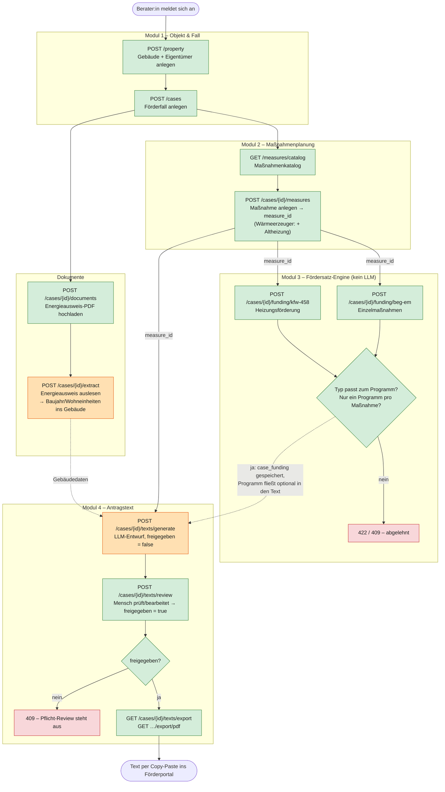

# Ablauf der BEG-Antrags-Software (Phase 0)

Vom Gebäude bis zum freigegebenen Antragstext. Grün = deterministischer Code,
Orange = LLM-Aufruf (über Langfuse beobachtet), Rot = Prüfung, die abbrechen kann.

## Die zwei Kernideen

- **Geld rechnet nie das LLM.** Fördersätze, Boni, Deckel und die Programmzuordnung
  laufen komplett in `app/modules/funding/` (deterministisch, testbar).
- **Kein LLM-Text ohne Mensch.** Jeder Entwurf startet mit `freigegeben = false`;
  Export gibt `409`, bis jemand ihn über `/texts/review` aktiv freigibt
  (`app/modules/documents/antrags_text_service.py`).

Die `measure_id` verbindet beides: Förderberechnung und Antragstext beziehen sich
immer auf dieselbe Maßnahme.
